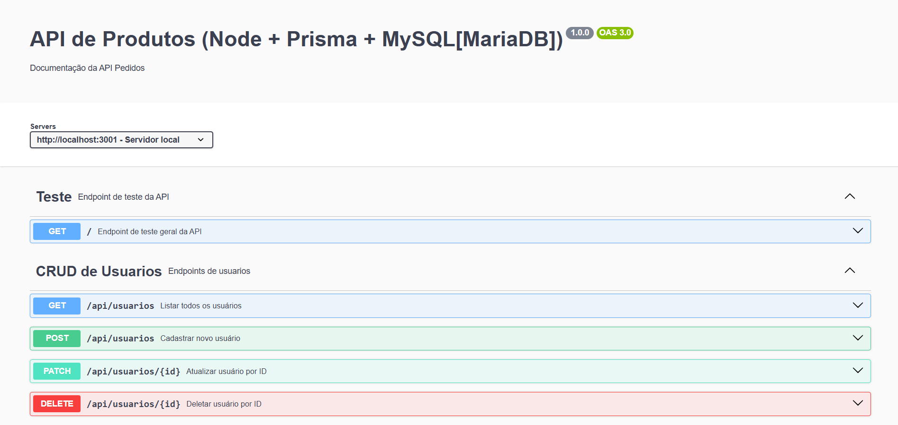
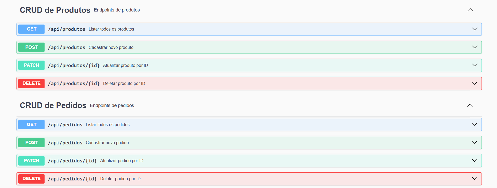
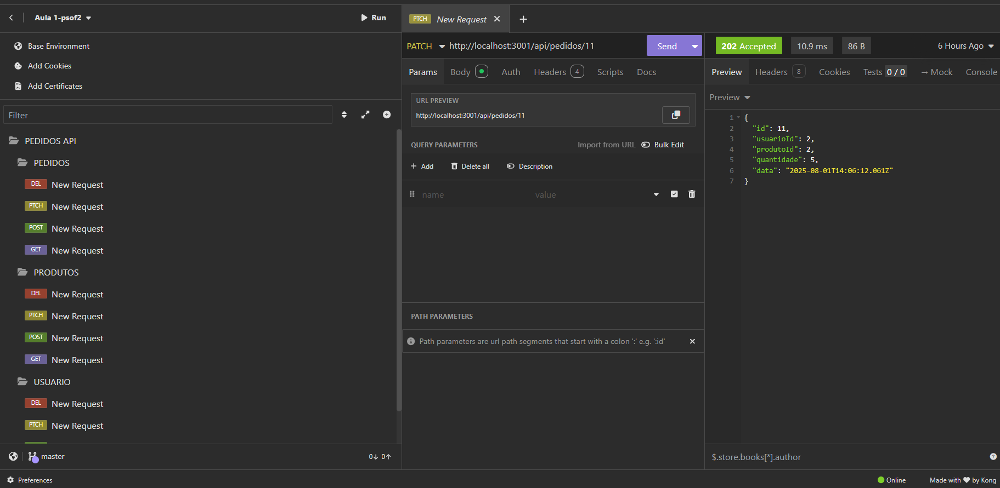

# Aula-1-psof2

# Aula01 - Recursos Avançados para Desenvolvimento de Software

## Criação de API e Documentação

Utilizaremos o **Swagger** para criar e documentar uma **API RESTful**.  
O Swagger é uma ferramenta poderosa que permite descrever a estrutura da API de forma clara e interativa.

---

## Capacidades Técnicas

1. Definir a sequência das atividades para desenvolvimento dos componentes, de acordo com os requisitos do sistema  
2. Definir a infraestrutura física a ser utilizada no desenvolvimento dos componentes  
3. Projetar os componentes do sistema considerando as plataformas computacionais  
4. Definir os softwares a serem utilizados no desenvolvimento do sistema  
5. Definir as dependências de software considerando os componentes do sistema, para a sua implantação  
6. Elaborar documentação técnica do sistema  
7. Implementar as funcionalidades de acordo com os requisitos definidos  

---

## Capacidades Socioemocionais

1. Demonstrar autogestão  
2. Demonstrar pensamento analítico  

---

## Conhecimentos

### 1. Qualidade de Software  
- 1.1. Definição  
- 1.2. Ferramentas  
- 1.3. Processos de trabalho  

### 3. Metodologia de Gerenciamento de Projeto  
- 3.1. Escopo  
- 3.5. Recursos  

## Print

